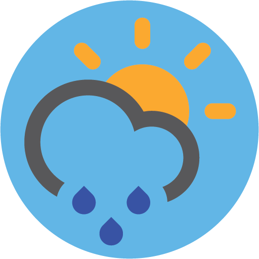

# WeatherBar: A macOS Weather App with Elegant UI

WeatherBar is a lightweight, elegant macOS menu bar application that provides quick access to weather information directly from your desktop.

> 🔒 Private Repository

---

WeatherBar is a lightweight, elegant macOS menu bar application that provides quick access to weather information directly from your desktop. Built with Swift and Cocoa, it delivers current conditions and forecasts while demonstrating clean architecture and thoughtful API integration.

## Features

- **Menu Bar Integration**: Displays current temperature and weather condition icon directly in the menu bar
- **Detailed Weather Information**: Shows current conditions, temperature, precipitation probability, and extended forecasts
- **Location-based Weather**: Automatically detects user location or allows manual city search
- **Beautiful Animations**: Features elegant animated weather icons that visualize current conditions
- **Multiple Weather Sources**: Integrates with National Weather Service and OpenWeatherMap APIs
- **Internationalization**: Supports global locations with automatic timezone detection
- **Unit Switching**: Toggle between Fahrenheit and Celsius based on preference
- **Auto-launch**: Option to launch at login for seamless experience

## Technical Highlights

- **Swift and Cocoa**: Built with modern Swift and leverages native macOS frameworks
- **Multi-source API Integration**: Gracefully handles multiple weather data sources with fallback mechanisms
- **Efficient Caching**: Implements LRU (Least Recently Used) cache for API responses
- **Asynchronous Operations**: Uses Swift's concurrency features for smooth performance
- **Geolocation Services**: Integration with CoreLocation for accurate positioning
- **Custom UI Components**: Features custom-built animated weather iconography
- **Thoughtful UX Design**: Prioritizes simplicity and quick access to information

## Screenshots

 

 

 

## Architecture

The application follows a clear separation of concerns:

- **Data Layer**: Handles API communication, caching, and data models
- **Business Logic**: Manages forecasts, location services, and data transformations
- **Presentation Layer**: Controls UI components and user interactions

## Purpose

WeatherBar demonstrates my ability to:
- Create polished, user-focused macOS applications
- Implement efficient API integrations with proper error handling
- Design intuitive interfaces for common information needs
- Write clean, maintainable Swift code with modern language features
- Balance technical complexity with user experience

This project showcases my skills in macOS development, API integration, and thoughtful UI/UX design - creating a useful daily utility that enhances the desktop experience.
